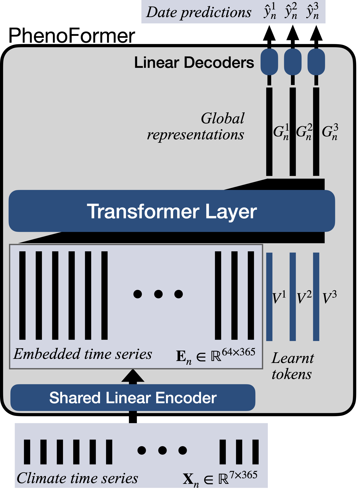

<div align="center">
<h1>🌳🌳  PhenoFormer: deep learning for species-level tree phenology 🌱🌿🌼🍁</h1>
</div>


This repository contains the code to reproduce the results presented in the article *Deep learning meets tree phenology modeling: PhenoFormer vs. process-based models*, Garnot et al. published in Methods in Ecology and Evolution. 

<div style="background-color: #f9f9f9; padding: 15px; border-left: 4px solid #007acc; font-style: italic; font-size: 14px; line-height: 1.5;">

Predicting phenology, i.e. the timing of seasonal events of plant life such as leaf emergence and colouration in relation to climate fluctuations, is essential for anticipating future changes in carbon sequestration and tree vitality in temperate forest ecosystems.
Existing approaches typically rely on either hypothesis-driven process models or data-driven statistical methods. Several studies have shown that process models outperform statistical methods when predicting under climatic conditions that differ from those of the training data, such as for climate change scenarios. However, in terms of statistical methods, deep learning approaches remain underexplored for species-level phenology modeling. 
We present a deep neural architecture, PhenoFormer, for species-level phenology prediction using meteorological time series. Our experiments utilize a country-scale dataset comprising 70 years of climate data and approximately 70,000 phenological observations of nine woody plant species, focusing on leaf emergence and colouration in Switzerland. We extensively compare PhenoFormer to $18$ different process-based models and traditional machine learning methods, including Random Forest (RF) and Gradient Boosted Machine (GBM). 
Our results demonstrate that PhenoFormer outperforms traditional statistical methods in phenology prediction while achieving significant improvements or comparable performance to the best process-based models. When predicting under climatic conditions similar to the training data, our model improved over the best process-based models by $6\%$ normalized root mean squared error (nRMSE) for spring phenology and $7\%$ nRMSE for autumn phenology. Under conditions involving substantial climatic shifts between training and testing ($+1.21^{\circ}C$), PhenoFormer reduced the nRMSE by an average of $8\%$ across species compared to RF and GBM, and performed on par with the best process models. 
These findings highlight the potential of deep learning for phenology modeling, and call for further research into this direction, particularly for future climate projections.  Meanwhile, the advancements achieved by PhenoFormer can provide valuable insights for anticipating species-specific phenological responses to climate change.
</div>

## 0. Setting up 📦

#### ⬇️ Download the dataset 
You can retrieve our dataset from our [Zenodo archive](https://zenodo.org/records/15045780). This dataset contains two subfolders: one version of the dataset formatted for R scripts and the other one for python scripts. Please use the `learning-models-data` subfolder for all python scripts. 

#### 🧑‍💻 Clone the repository and install requirements
```
git clone git@github.com:VSainteuf/PhenoFormer.git
cd PhenoFormer
conda create --name phenoformer python==3.10
conda activate phenoformer
pip install -r requirements.txt
```
We recommend to create a new virtual environment with `python==3.10` :

> ⚠️ If you run into issues , make sure that your pip version is < 24.1 by running:

```setup
pip install pip==24.0
```

#### ⚙ Hardware

For the deep learning scripts, we recommend using a machine with GPU to have reasonable training times. Our models are still quite small (for deep learning standards) so a small GPU of even 4 or 8GB VRAM would do. 


## 1. PhenoFormer ⭐️

<div style="display: flex; align-items: center;">
  <div style="flex: 1;">
    <!-- Left side text -->
    PhenoFormer is an architecture designed for species-level phenology modeling. It takes daily climatic time series as input, and predicts the date of occurence of a given phenophase. PhenoFormer relies on a transformer layer for temporal encoding and learnt tokens. This architecture easliy enables multi-task traning, where the same model is trained to predict the phenophases of multiple species at the same time. 
  </div>
  <div style="flex: 1; text-align: center;">
    <!-- Right side image -->
    
  </div>
</div>

There are four scripts to run the different configurations of PhenoFormer:
- `run-phenoformer-singlespecies-spring.py` to train the single-species PhenoFormer for spring phenology (variant (a) in Table 6)
- `run-phenoformer-multispecies-spring.py` to train the multi-species variants of PhenoFormer for spring phenology (variants (b->e) in Table 6)
- `run-phenoformer-singlespecies-autumn.py` to train the single-species variants of PhenoFormer for autumn phenology (variants (a,f) in Table 9)
- `run-phenoformer-multispecies-autumn.py` to train the multi-species variants of PhenoFormer for autumn phenology (variants (b,d) in Table 9)

#### 👟 Training 

To run each of these script:
1. Complete the `data_folder` field with the path to the `learning-models-data` dataset folder on your machine. 
2. Complete the `save_dir` field with the path to the folder where to write the results. 
3. (Optional) Comment/Uncomment the configuration of the variant you would like to train.
4. Activate the proper python environement and run the script.

#### 🔢 Results 

The results of each configuration (model x dataset split) gets written in a separate subdirectory in `save_dir`.
The scripts will execute the 40 runs for each configuration by default. 
So in each subdirectory you will find one result file per fold with the following name `run_summary_foldX.json` .
The result files contain all the values of the different hyperparameters as well as the performance metrics on the train, validation, and test sets. 

## 2. Pre-trained weights and demo notebook 
You can find pre-trained weights of different variants of PhenoFormer in the [`pre-trained-weights`](https://github.com/VSainteuf/PhenoFormer/tree/main/pre-trained-weights) folder. 
The jupyter notebook [`demo.ipynb`](https://github.com/VSainteuf/PhenoFormer/blob/main/demo.ipynb) will guide you through the process of loading those weights and making predictions. 

## 3. Traditional machine learning baselines 🪛

The present repository also contains the code to reproduce the results of the traditional machine learning baselines. 

To do so use the `run-traditional-ml-baselines.py` script and follow these steps:
1. Complete the `data_folder` field with the path to the `learning-models-data` dataset folder on your machine. 
2. Complete the `save_dir` field with the path to the folder where to write the results. 
3. Comment/Uncomment the configuration of the variant you would like to train.
4. Activate the proper python environement and run the script.


## 4. Process-based models 🔃
In addition, we provide the R scripts used to evaluate the performance of process-based models used in our study (see the `/process-based-models` subfolder and associated readme file) .

## 5. Full results of the article 🔢
We also provide the complete and detailed numerical results used in the paper (`results/full_results.csv`). 


## 📯 Credits 

To cite this work please use:
```bibtex
@article{phenoformer2025,  
  title={Deep learning meets tree phenology modeling: PhenoFormer vs. process-based models},  
  author={Garnot, Vivien Sainte Fare and Spafford, Lynsay and Lever, Jelle and 
  Sigg, Christian and Pietragalla, Barbara and Vitasse, Yann 
  and Gessler, Arthur and Wegner, Jan Dirk},  
  journal={{Methods in Ecology and Evolution}},  
  year={2025}  
}  
```

- Data source: Federal Office of Meteorology and Climatology (MeteoSwiss)  
- Meteorological data processing: Swiss Federal Institute for Forest, 
Snow and Landscape Research (WSL)
- This project was co-financed by the Federal Office for Meteorology and Climatology MeteoSwiss within the framework of GAW-CH.
